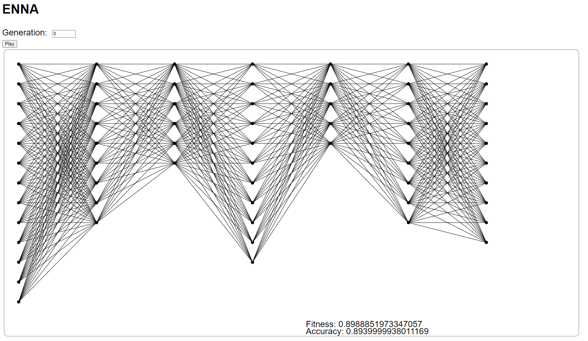

# Evolving Neural Network Architectures

This project attempts to use an "evolutionary algorithm" to evolve the architectures of neural networks.

## Approach

A "population" of neural networks is generated, then the fitness of its members is tested (where fitness is
proportional to classification accuracy on some dataset).
The networks with the highest fitness are selected for recombination to create the next generation of networks.
This process is repeated until a generation limit is reached.

## Results

The implementation in this repository reliably causes the accuracy of the networks in the population to decrease.
This is likely mostly due to the naive mutation and recombination strategies used.

## Visualization

The `visualization` folder contains the code for a basic web-based visualization of how the best network
in the population changed through the generations.

To visualize another run, the CSV file loaded by d3 in the `index.js` file needs to be changed.

## Note
The code does not always follow good practices, and is meant as an experiment rather than as a revolution in how
deep learning is implemented.
Other people have done similar things with much more success.
